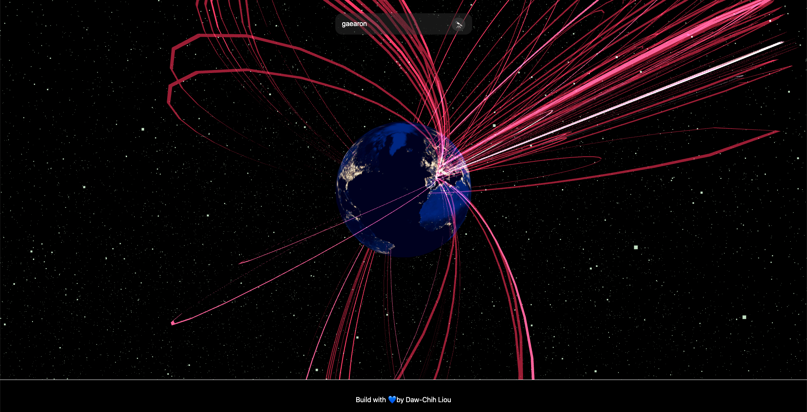

# Concurrent React Stress Testing

Stress Testing for React 18's Concurrent Features.



This project is built with

- [React 18](https://reactjs.org/blog/2022/03/29/react-v18.html)
- [Next.js](https://nextjs.org)
- [React Three Fiber](https://docs.pmnd.rs/react-three-fiber/getting-started/introduction)
- [Apollo GraphQL](https://www.apollographql.com)

## Live Demo

You can find the [live demo on Netlify](https://sweaty-concurrent-react.netlify.app).

Please note that the demo might crash due to a [task timeout](https://answers.netlify.com/t/error-502-errormessage-task-timed-out-after-10-01-seconds-nextjs/33332/7). The timeout is caused by the slow API call to `/api/coordinates`. This experimental API is built to fetch the coordinates of the cities. If you'd like to interact with the demo, it's recommended to fork the repo and run the development server locally.

## Getting Started

First, install the dependencies

```bash
yarn
```

and run the development server:

```bash
yarn dev
```

## Available Scripts

#### `yarn dev`

to start development server

#### `yarn start`

to start production server

#### `yarn build`

to generate production build. The built assets will be in under `/.next` directory.

#### `yarn export`

to export the app to static HTML, which can be run standalone without the need of a Node.js server.
